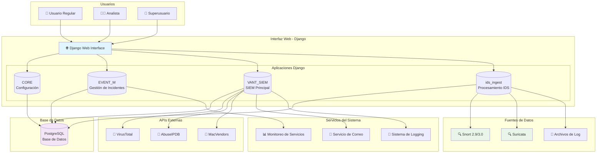
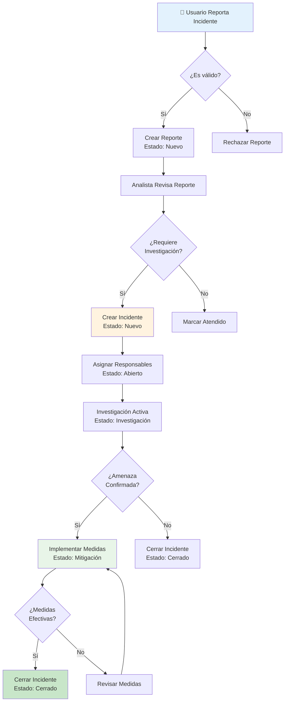
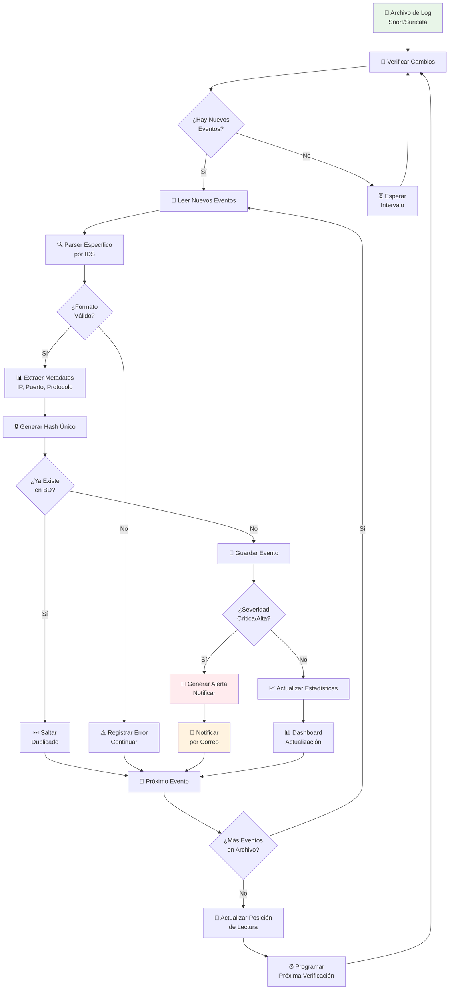
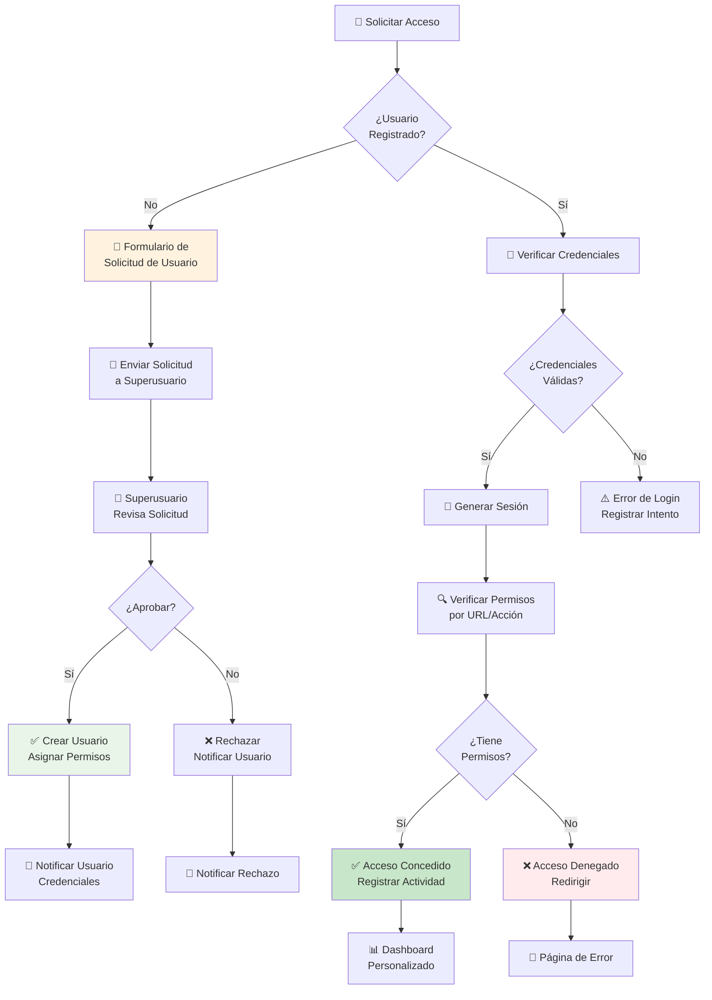
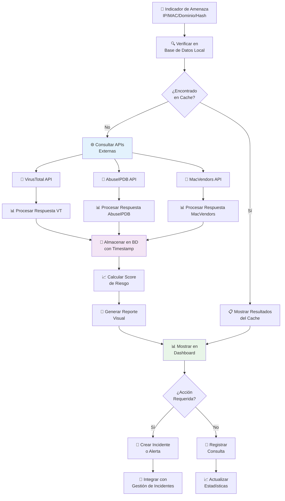
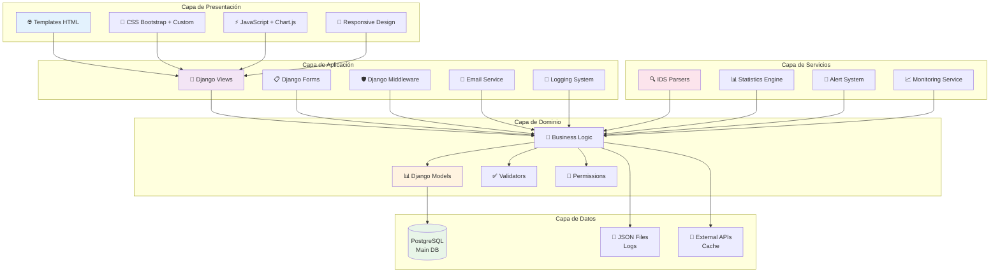
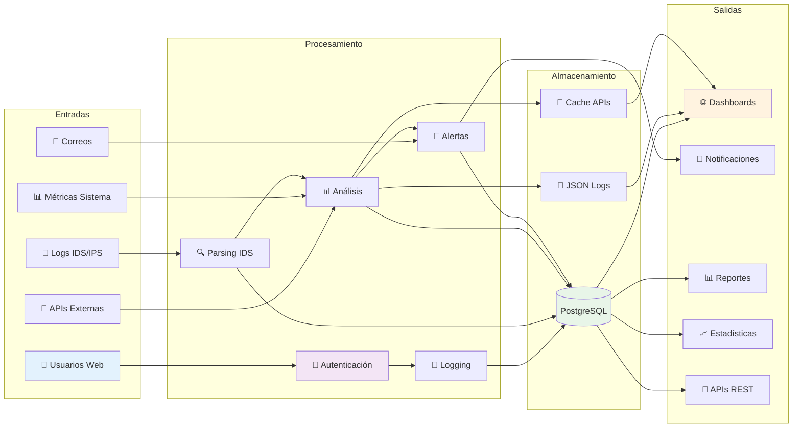

# Arquitectura y Diagramas de Flujo - VANT-SIEM CORE

## Diagrama General de Arquitectura

## Flujo de Gestión de Incidentes

## Flujo de Procesamiento IDS/IPS

## Flujo de Autenticación y Autorización

## Flujo de Análisis de Amenazas

## Diagrama de Componentes del Sistema

## Flujo de Datos del Sistema

## Leyenda de Iconos

| Icono | Significado             |
| ----- | ----------------------- |
| 👤    | Usuario/Actor           |
| 🌐    | Interfaz Web            |
| 📊    | Dashboard/Análisis      |
| 💾    | Base de Datos           |
| 🔍    | Sistema IDS             |
| 📧    | Correo Electrónico      |
| 🚨    | Alertas/Notificaciones  |
| 🔐    | Seguridad/Autenticación |
| 📝    | Logging/Auditoría       |
| ⚙️    | Configuración           |
| 🔄    | Procesos/Flujos         |
| ✅    | Éxito/Confirmación      |
| ❌    | Error/Rechazo           |
| ⏳    | Espera/Tiempo           |
| 📈    | Estadísticas/Métricas   |

---

**Estos diagramas proporcionan una visión completa de la arquitectura y flujos de VANT-SIEM CORE, facilitando el entendimiento del sistema para desarrolladores, administradores y usuarios finales.**
